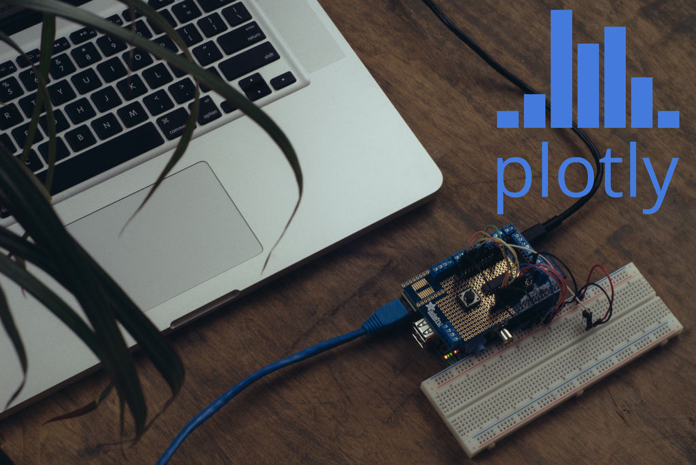

# Raspberry Pi Realtime Streaming with Plot.ly
[](https://raspberrypi.com)
### This is an example of a streaming graph: [http://plot.ly/~streaming-demos/6/](http://plot.ly/~streaming-demos/6/)


### This is a tutorial on streaming with the Raspberry Pi
First, install the required modules and dependencies:
```bash
sudo apt-get install python-dev
wget https://bitbucket.org/pypa/setuptools/raw/bootstrap/ez_setup.py -O - | sudo python
sudo easy_install -U distribute
sudo apt-get install python-pip
sudo pip install rpi.gpio
sudo pip install plotly
```

Create your sensor reading script, and start importing some modules in it!
```python
import plotly.plotly as py # plotly library
from plotly.graph_objs import Scatter, Layout, Figure # plotly graph objects
import json # used to parse config.json
import time # timer functions
import readadc # helper functions to read ADC from the Raspberry Pi
import datetime
```

Make sure to update the credentials in the script with your own!
```python
username = 'your_plotly_username'
api_key = 'your_api_key'
stream_token = 'your_stream_token'
```
If you don't know your credentials : 

Sign up to plotly here: [https://plot.ly/ssu](https://plot.ly/ssu)
View your API key and streaming tokens here: [https://plot.ly/settings](https://plot.ly/settings)

Initialize a Plotly Object
```python
py.sign_in(username, api_key)
```

Initialize your graph (not streaming yet)
```python
data = [Scatter(x=[],y=[],stream={'token': stream_token, 'maxpoints': 1000})]
layout = Layout(title='Live graphing from a Raspberry Pi')
your_graph_url = py.plot(Figure(data=data, layout=layout), filename='Raspi Graph', auto_open=False)
```

Specify the connected channel for your sensor
```python
sensor_pin = 0
```

Initialize the GPIO
```python
readadc.initialize()
```

Initialize the Plotly Streaming Object
```python
stream = py.Stream(stream_token)
stream.open()
```

Start looping and streamin'!
```python
while True:
	sensor_data = readadc.readadc(sensor_pin, readadc.PINS.SPICLK, readadc.PINS.SPIMOSI, readadc.PINS.SPIMISO, readadc.PINS.SPICS)
	stream.write({'x': datetime.datetime.now(), 'y': sensor_data})
	time.sleep(0.1) # delay between stream posts
```

Your graph will be visible in your plotly account ([https://plot.ly/plot](https://plot.ly/plot)) and at `your_graph_url`, the value assigned by the `py.plot` call above.

### Contact
Questions? Suggestions? Something not look right? Get in touch!

- [@plotlygraphs](https://twitter.com/plotlygraphs)
- <chris@plot.ly>
